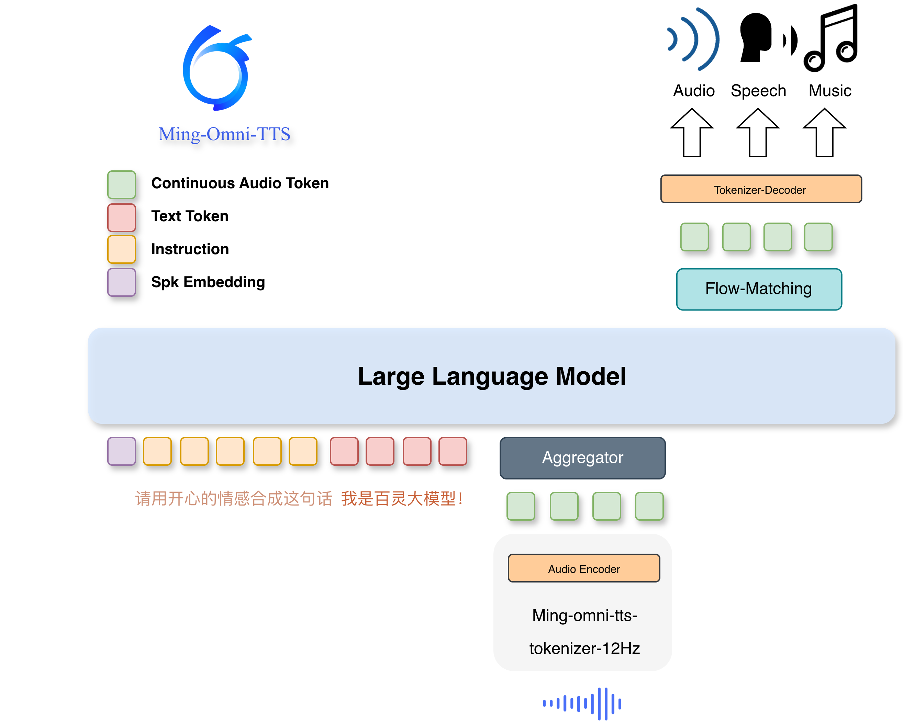
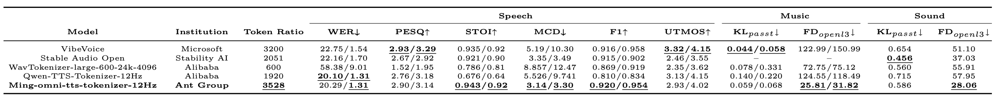

<div style="
  display: flex;
  justify-content: center;
  align-items: center;
  gap: 16px;
  margin: 24px 0;
">

  <h1 style="margin: 0;">
        Ming-omni-tts: Simple and Efficient Unified Generation of Speech, Music, and Sound with Precise Control
  </h1>
  
</div>


<p align="center">🌐<a href="https://xqacmer.github.io/Ming-omni-tts/">Project Page</a> ｜🤗 <a href="https://huggingface.co/inclusionAI/Ming-omni-tts-0.5B">Hugging Face</a>｜ 🤖 <a href="https://modelscope.cn/models/inclusionAI/Ming-omni-tts-0.5B">ModelScope</a> | 🎮 <a href="https://modelscope.cn/studios/antsipan/ming-uniaudio-demo">Gradio Demo-zh</a> | 🎮 <a href="https://huggingface.co/spaces/cafe3310/ming-uniaudio-demo-en">Gradio Demo-en</a> | 💬 <a href="https://qr.dingtalk.com/action/joingroup?code=v1,k1,O7MiZqrOrB2c7PnUZVBNvmDh/6tghNLMEtXqMteyRIpuRVJIwrSsXmL8oFqU5ajJ&_dt_no_comment=1&origin=11? ">DingTalk(钉钉)</a>

## Table of Contents
- [Introduction](#introduction)
- [Demo](#demo)
- [Updates](#updates)
- [Key Features](#-key-features)
- [Evaluation](#evaluation)
  - [Audio Tokenizer](#audio-tokenizer)
  - [Speech Controllable Generative Tasks](#speech-controllable-generative-tasks)
  - [Audio & BGM Generation](#audio--bgm-generation)
  - [Text Normalization](#text-normalization)
- [Model & Benchmark Downloads](#model--benchmark-downloads)
- [Environment Preparation](#environment-preparation)
- [Example Usage](#example-usage)
  - [Audio Reconstruction](#audio-reconstruction)
  - [Audio Generation](#audio-generative)
- [Citation](#citation)

## Introduction

Ming-omni-tts is a high-performance unified audio generation model that achieves precise control over speech attributes and enables single-channel synthesis of speech, environmental sounds, and music. Powered by a custom 12.5Hz continuous tokenizer and Patch-by-Patch compression, it delivers competitive inference efficiency (3.1Hz). Additionally, the model features robust text normalization capabilities for the accurate and natural narration of complex mathematical and chemical expressions.

<strong>🚀 Core Capabilities</strong>

- 🔊 **Fine-grained Vocal Control:** The model supports precise control over speech rate, pitch, volume, emotion, and dialect through simple commands. Notably, its accuracy for Cantonese dialect control is as high as **93%**, and its emotion control accuracy reaches **46.7%**, surpassing CosyVoice3.
- 🌌  **Intelligent Voice Design:** Features 100+ premium built-in voices and supports zero-shot voice design through natural language descriptions. Its performance on the Instruct-TTS-Eval-zh benchmark is on par with Qwen3-TTS.
- 🎶  **Immersive Unified Generation:** The industry’s first autoregressive model to jointly generate speech, ambient sound, and music in a single channel. Built on a custom 12.5Hz continuous tokenizer and a DiT head architecture, it delivers a seamless, "in-the-scene" auditory experience.
- ⚡ **High-efficiency Inference:** Introduces a "Patch-by-Patch" compression strategy that reduces the LLM inference frame rate to 3.1Hz. This significantly cuts latency and enables podcast-style audio generation while preserving naturalness and audio detail.
- 🧪 **Professional Text Normalization:** The model accurately parses and narrates complex formats, including mathematical expressions and chemical equations, ensuring natural-sounding output for specialized applications.

## Demo

https://github.com/user-attachments/assets/eb0e900e-ed5e-40ca-98df-31c244939527


## Updates

- [ ] Support VLLM Inference
- [ ] Technical Report
- [x] [Ming-omni-tts Blog](https://xqacmer.github.io/Ming-Flash-Omni-V2-TTS/)

## 🚀 Key Features
Ming-omni-tts features key optimizations as follows, compared to other audio-assisted LLMs:
- **Unified Continuous Audio Tokenizer**: We propose a continuous VAE-based tokenizer that integrates speech, music, and general audio into a unified latent space with 12.5 Hz frame rate, yielding competitive results across audio reconstruction and various downstream synthesis benchmarks.
<p align="center">
    
<p>

- **Unified Audio Language Model for Speech, Music and Sound Generation**: We present a unified, end-to-end audio language model that employs a single LLM backbone to perform joint generation of speech, music, and general sound. To enhance audio quality, the architecture is augmented with a Diffusion Head. Furthermore, we employ a patch-based generation strategy with a patch size of 4 and a look-back history of 32, enabling an optimal balance between local acoustic detail and long-range structural coherence.

<p align="center">
    
<p>

##  Evaluation
- **Reconstruction:** The 12Hz tokenizer supports high-quality reconstruction across speech, music, and sound. Its performance is comparable to existing state-of-the-art methods across key fidelity metrics.
- **Dialect Generation:** Achieves **96%** accuracy on WSYue-TTS-Eval and **86%** WSC-TTS-Eval, outperforming CosyVoice3.
- **Emotional Expressiveness:** Delivers an average accuracy of **76.7%** on CV3-Eval emotional sets and **46.7%** on neutral emotion sets, significantly surpassing CosyVoice3-Base (40%) to reach SOTA levels.
- **Instruction-based Voice Design:** Scores **76.20%** on InstructTTS-Eval-ZH. Its instruction-following capability is on par with Qwen3-TTS-VoiceDesign.
- **Zero-shot Voice Clone:** Exhibits exceptional stability on Seed-tts-eval (Chinese) with a WER of **0.83%**, outperforming SeedTTS and GLM-TTS.
- **Text Normalization (TN):** On internal technical testsets, the model achieves a CER of **1.97%** in normalized regions, delivering performance comparable to Gemini-2.5 Pro.


### Audio Tokenizer
Speech metrics are evaluated on AISHELL-3(44.1khz-Chinese) and VCTK(44.1khz-English).  
Music metrics are evaluated on MUSDB18(44.1khz) and MUSDB18-HQ(44.1khz).   
Audio metrics are evaluated on AudioCaps.  

<p align="center">
    
<p>


### Speech Controllable Generative Tasks
#### Zero-shot TTS
<table style="border-collapse: collapse; width: 100%; border-top: 1px solid #000; border-bottom: 1px solid #000; font-family: Arial, sans-serif; margin: 16px 0;">
  <caption><strong>Zero-shot speech generation performance comparison on the Seed-TTS testset.</strong></caption>
  <thead>
    <tr>
      <th rowspan="2" style="text-align: center; padding: 10px 8px; border: none; border-bottom: 1px solid #000;">Model</th>
      <th rowspan="2" style="text-align: center; padding: 10px 8px; border: none; border-bottom: 1px solid #000;">Institution</th>
      <th colspan="2" style="text-align: center; padding: 10px 8px; border: none; border-bottom: 1px solid #000;">seed-tts-eval-zh</th>
      <th colspan="2" style="text-align: center; padding: 10px 8px; border: none; border-bottom: 1px solid #000;">seed-tts-eval-en</th>
    </tr>
    <tr>
      <th style="text-align: center;padding: 8px; border: none; border-bottom: 1px solid #000;">WER ↓</th>
      <th style="text-align: center;padding: 8px; border: none; border-bottom: 1px solid #000;">SIM ↑</th>
      <th style="text-align: center;padding: 8px; border: none; border-bottom: 1px solid #000;">WER ↓</th>
      <th style="text-align: center;padding: 8px; border: none; border-bottom: 1px solid #000;">SIM ↑</th>
    </tr>
  </thead>
  <tbody>
    <tr>
      <td style="text-align: center; padding: 8px; border: none;">Seed-TTS</td>
      <td style="text-align: center; padding: 8px; border: none;">BytedanceSpeech</td>
      <td style="text-align: center; padding: 8px; border: none;">1.11</td>
      <td style="text-align: center; padding: 8px; border: none;"><strong><u>0.796</u></strong></td>
      <td style="text-align: center; padding: 8px; border: none;">2.24</td>
      <td style="text-align: center; padding: 8px; border: none;"><strong><u>0.762</u></strong></td>
    </tr>
    <tr>
      <td style="text-align: center; padding: 8px; border: none;">MaskGCT</td>
      <td style="text-align: center; padding: 8px; border: none;">College</td>
      <td style="text-align: center; padding: 8px; border: none;">2.27</td>
      <td style="text-align: center; padding: 8px; border: none;">0.774</td>
      <td style="text-align: center; padding: 8px; border: none;">2.62</td>
      <td style="text-align: center; padding: 8px; border: none;">0.714</td>
    </tr>
    <tr>
      <td style="text-align: center; padding: 8px; border: none;">E2 TTS</td>
      <td style="text-align: center; padding: 8px; border: none;">Microsoft</td>
      <td style="text-align: center; padding: 8px; border: none;">1.97</td>
      <td style="text-align: center; padding: 8px; border: none;">0.730</td>
      <td style="text-align: center; padding: 8px; border: none;">2.19</td>
      <td style="text-align: center; padding: 8px; border: none;">0.710</td>
    </tr>
    <tr>
      <td style="text-align: center; padding: 8px; border: none;">F5-TTS</td>
      <td style="text-align: center; padding: 8px; border: none;">College</td>
      <td style="text-align: center; padding: 8px; border: none;">1.56</td>
      <td style="text-align: center; padding: 8px; border: none;">0.741</td>
      <td style="text-align: center; padding: 8px; border: none;">1.83</td>
      <td style="text-align: center; padding: 8px; border: none;">0.647</td>
    </tr>
    <tr>
      <td style="text-align: center; padding: 8px; border: none;">CosyVoice 2</td>
      <td style="text-align: center; padding: 8px; border: none;">Alibaba</td>
      <td style="text-align: center; padding: 8px; border: none;">1.45</td>
      <td style="text-align: center; padding: 8px; border: none;">0.748</td>
      <td style="text-align: center; padding: 8px; border: none;">2.57</td>
      <td style="text-align: center; padding: 8px; border: none;">0.652</td>
    </tr>
    <tr>
      <td style="text-align: center; padding: 8px; border: none;">Qwen3-Omni-30B-A3B</td>
      <td style="text-align: center; padding: 8px; border: none;">Alibaba</td>
      <td style="text-align: center; padding: 8px; border: none;">1.07</td>
      <td style="text-align: center; padding: 8px; border: none;">–</td>
      <td style="text-align: center; padding: 8px; border: none;">1.39</td>
      <td style="text-align: center; padding: 8px; border: none;">–</td>
    </tr>
    <tr>
      <td style="text-align: center; padding: 8px; border: none;">CosyVoice 3-0.5B</td>
      <td style="text-align: center; padding: 8px; border: none;">Alibaba</td>
      <td style="text-align: center; padding: 8px; border: none;">1.16</td>
      <td style="text-align: center; padding: 8px; border: none;">0.780</td>
      <td style="text-align: center; padding: 8px; border: none;">2.02</td>
      <td style="text-align: center; padding: 8px; border: none;">0.718</td>
    </tr>
    <tr>
      <td style="text-align: center; padding: 8px; border: none;">CosyVoice 3-1.5B</td>
      <td style="text-align: center; padding: 8px; border: none;">Alibaba</td>
      <td style="text-align: center; padding: 8px; border: none;"><strong><u>0.71</u></strong></td>
      <td style="text-align: center; padding: 8px; border: none;">0.775</td>
      <td style="text-align: center; padding: 8px; border: none;">1.45</td>
      <td style="text-align: center; padding: 8px; border: none;">0.695</td>
    </tr>
    <tr>
      <td style="text-align: center; padding: 8px; border: none;">Qwen3-TTS-25Hz-0.6B-Base</td>
      <td style="text-align: center; padding: 8px; border: none;">Alibaba</td>
      <td style="text-align: center; padding: 8px; border: none;">1.18</td>
      <td style="text-align: center; padding: 8px; border: none;">–</td>
      <td style="text-align: center; padding: 8px; border: none;">1.64</td>
      <td style="text-align: center; padding: 8px; border: none;">–</td>
    </tr>
    <tr>
      <td style="text-align: center; padding: 8px; border: none;">Qwen3-TTS-25Hz-1.7B-Base</td>
      <td style="text-align: center; padding: 8px; border: none;">Alibaba</td>
      <td style="text-align: center; padding: 8px; border: none;">1.10</td>
      <td style="text-align: center; padding: 8px; border: none;">–</td>
      <td style="text-align: center; padding: 8px; border: none;">1.49</td>
      <td style="text-align: center; padding: 8px; border: none;">–</td>
    </tr>
    <tr>
      <td style="text-align: center; padding: 8px; border: none;">Qwen3-TTS-12Hz-0.6B-Base</td>
      <td style="text-align: center; padding: 8px; border: none;">Alibaba</td>
      <td style="text-align: center; padding: 8px; border: none;">0.92</td>
      <td style="text-align: center; padding: 8px; border: none;">–</td>
      <td style="text-align: center; padding: 8px; border: none;">1.32</td>
      <td style="text-align: center; padding: 8px; border: none;">–</td>
    </tr>
    <tr>
      <td style="text-align: center; padding: 8px; border: none;">Qwen3-TTS-12Hz-1.7B-Base</td>
      <td style="text-align: center; padding: 8px; border: none;">Alibaba</td>
      <td style="text-align: center; padding: 8px; border: none;">0.77</td>
      <td style="text-align: center; padding: 8px; border: none;">–</td>
      <td style="text-align: center; padding: 8px; border: none;"><strong><u>1.24</u></strong></td>
      <td style="text-align: center; padding: 8px; border: none;">–</td>
    </tr>
    <tr>
      <td style="text-align: center; padding: 8px; border: none;">GLM-TTS</td>
      <td style="text-align: center; padding: 8px; border: none;">Zhipu AI</td>
      <td style="text-align: center; padding: 8px; border: none;">1.03</td>
      <td style="text-align: center; padding: 8px; border: none;">0.761</td>
      <td style="text-align: center; padding: 8px; border: none;">2.23</td>
      <td style="text-align: center; padding: 8px; border: none;">0.672</td>
    </tr>
    <tr>
      <td style="text-align: center; padding: 8px; border: none;">Ming-Flash-Omni-preview</td>
      <td style="text-align: center; padding: 8px; border: none;">Ant Group</td>
      <td style="text-align: center; padding: 8px; border: none;">0.99</td>
      <td style="text-align: center; padding: 8px; border: none;">0.740</td>
      <td style="text-align: center; padding: 8px; border: none;">1.59</td>
      <td style="text-align: center; padding: 8px; border: none;">0.680</td>
    </tr>
    <tr>
      <td style="text-align: center; padding: 8px; border: none;"><strong><u>Ming-omni-tts-0.5B(ours)</u></strong></td>
      <td style="text-align: center; padding: 8px; border: none;">Ant Group</td>
      <td style="text-align: center; padding: 8px; border: none;">0.87</td>
      <td style="text-align: center; padding: 8px; border: none;">0.72</td>
      <td style="text-align: center; padding: 8px; border: none;">2.19</td>
      <td style="text-align: center; padding: 8px; border: none;">0.61</td>
    </tr>
    <tr>
      <td style="text-align: center; padding: 8px; border: none;"><strong><u>Ming-omni-tts-16.8B-A3B(ours)</u></strong></td>
      <td style="text-align: center; padding: 8px; border: none;">Ant Group</td>
      <td style="text-align: center; padding: 8px; border: none;">0.83</td>
      <td style="text-align: center; padding: 8px; border: none;">0.75</td>
      <td style="text-align: center; padding: 8px; border: none;">2.02</td>
      <td style="text-align: center; padding: 8px; border: none;">0.62</td>
    </tr>
  </tbody>
</table>

#### Speech Attribute Control

<table style="border-collapse: collapse; width: 100%; border-top: 1px solid #000; border-bottom: 1px solid #000; font-family: Arial, sans-serif; margin: 16px 0;">
  <thead>
    <tr>
      <th rowspan="2" style="text-align: center; padding: 10px 8px; border: none; border-bottom: 1px solid #000;">Model</th>
      <th rowspan="2" style="text-align: center; padding: 10px 8px; border: none; border-bottom: 1px solid #000;">Institution</th>
      <th colspan="4" style="text-align: center; padding: 10px 8px; border: none; border-bottom: 1px solid #000;">Instruction success rate</th>
      <th rowspan="2" style="text-align: center; padding: 10px 8px; border: none; border-bottom: 1px solid #000;">wer</th>
      <th rowspan="2" style="text-align: center; padding: 10px 8px; border: none; border-bottom: 1px solid #000;">sim</th>
    </tr>
    <tr>
      <th style="text-align: center;padding: 8px; border: none; border-bottom: 1px solid #000;">speech rate</th>
      <th style="text-align: center;padding: 8px; border: none; border-bottom: 1px solid #000;">speech volume</th>
      <th style="text-align: center;padding: 8px; border: none; border-bottom: 1px solid #000;">speech F0</th>
      <th style="text-align: center;padding: 8px; border: none; border-bottom: 1px solid #000;">avg.</th>
    </tr>
  </thead>
  <tbody>
    <tr>
      <td style="text-align: center; padding: 8px; border: none;">CosyVoice3</td>
      <td style="text-align: center; padding: 8px; border: none;">Alibaba</td>
      <td style="text-align: center; padding: 8px; border: none;"><strong><u>100%</u></strong></td>
      <td style="text-align: center; padding: 8px; border: none;"><strong><u>97.67%</u></strong></td>
      <td style="text-align: center; padding: 8px; border: none;">65.33%</td>
      <td style="text-align: center; padding: 8px; border: none;">87.67%</td>
      <td style="text-align: center; padding: 8px; border: none;">1.21%</td>
      <td style="text-align: center; padding: 8px; border: none;">0.58</td>
    </tr>
    <tr>
      <td style="text-align: center; padding: 8px; border: none;"><strong><u>Ming-omni-tts-0.5B(ours)</u></strong></td>
      <td style="text-align: center; padding: 8px; border: none;">Ant Group</td>
      <td style="text-align: center; padding: 8px; border: none;">97.67%</td>
      <td style="text-align: center; padding: 8px; border: none;">95.00%</td>
      <td style="text-align: center; padding: 8px; border: none;"><strong><u>91.33%</u></strong></td>
      <td style="text-align: center; padding: 8px; border: none;"><strong><u>94.67%</u></strong></td>
      <td style="text-align: center; padding: 8px; border: none;"><strong><u>0.27%</u></strong></td>
      <td style="text-align: center; padding: 8px; border: none;">0.712</td>
    </tr>
    <tr>
      <td style="text-align: center; padding: 8px; border: none;"><strong><u>Ming-omni-tts-16.8B-A3B(ours)</u></strong></td>
      <td style="text-align: center; padding: 8px; border: none;">Ant Group</td>
      <td style="text-align: center; padding: 8px; border: none;">96.33%</td>
      <td style="text-align: center; padding: 8px; border: none;">97.00%</td>
      <td style="text-align: center; padding: 8px; border: none;">83.67%</td>
      <td style="text-align: center; padding: 8px; border: none;">92.33%</td>
      <td style="text-align: center; padding: 8px; border: none;">0.347%</td>
      <td style="text-align: center; padding: 8px; border: none;"><strong><u>0.776</td>
    </tr>
  </tbody>
</table>

#### Emotional Control
Below is a comparison between Ming-omni-tts and other state-of-the-art (SOTA) models on the emotion control task.
<table style="border-collapse: collapse; width: 100%; border-top: 1px solid #000; border-bottom: 1px solid #000; font-family: Arial, sans-serif; margin: 16px 0;">
  <caption><strong>Emotion Accuracy on the Text-Related and Text-Unrelated of the CV3-Eval Emotional testsets</strong></caption>
  <thead>
    <tr>
      <th rowspan="2" style="text-align: center; padding: 10px 8px; border: none; border-bottom: 1px solid #000;">Model</th>
      <th rowspan="2" style="text-align: center; padding: 10px 8px; border: none; border-bottom: 1px solid #000;">Institution</th>
      <th rowspan="2" style="text-align: center; padding: 10px 8px; border: none; border-bottom: 1px solid #000;">Average</th>
      <th colspan="3" style="text-align: center; padding: 10px 8px; border: none; border-bottom: 1px solid #000;">Text-Related</th>
      <th colspan="3" style="text-align: center; padding: 10px 8px; border: none; border-bottom: 1px solid #000;">Text-Unrelated</th>
    </tr>
    <tr>
      <th style="text-align: center;padding: 8px; border: none; border-bottom: 1px solid #000;">happy</th>
      <th style="text-align: center;padding: 8px; border: none; border-bottom: 1px solid #000;">sad</th>
      <th style="text-align: center;padding: 8px; border: none; border-bottom: 1px solid #000;">angry</th>
      <th style="text-align: center;padding: 8px; border: none; border-bottom: 1px solid #000;">happy</th>
      <th style="text-align: center;padding: 8px; border: none; border-bottom: 1px solid #000;">sad</th>
      <th style="text-align: center;padding: 8px; border: none; border-bottom: 1px solid #000;">angry</th>
    </tr>
  </thead>
  <tbody>
    <tr>
      <td style="text-align: center; padding: 8px; border: none;">F5-TTS</td>
      <td style="text-align: center; padding: 8px; border: none;">SJTU</td>
      <td style="text-align: center; padding: 8px; border: none;">0.647</td>
      <td style="text-align: center; padding: 8px; border: none;">0.92</td>
      <td style="text-align: center; padding: 8px; border: none;">0.52</td>
      <td style="text-align: center; padding: 8px; border: none;">0.72</td>
      <td style="text-align: center; padding: 8px; border: none;">0.80</td>
      <td style="text-align: center; padding: 8px; border: none;">0.28</td>
      <td style="text-align: center; padding: 8px; border: none;">0.64</td>
    </tr>
    <tr>
      <td style="text-align: center; padding: 8px; border: none;">Sparks-TTS</td>
      <td style="text-align: center; padding: 8px; border: none;">HKST</td>
      <td style="text-align: center; padding: 8px; border: none;">0.553</td>
      <td style="text-align: center; padding: 8px; border: none;">0.80</td>
      <td style="text-align: center; padding: 8px; border: none;">0.56</td>
      <td style="text-align: center; padding: 8px; border: none;">0.50</td>
      <td style="text-align: center; padding: 8px; border: none;">0.50</td>
      <td style="text-align: center; padding: 8px; border: none;"><strong><u>0.60</u></strong></td>
      <td style="text-align: center; padding: 8px; border: none;">0.36</td>
    </tr>
    <tr>
      <td style="text-align: center; padding: 8px; border: none;">GPT-SoVits</td>
      <td style="text-align: center; padding: 8px; border: none;"></td>
      <td style="text-align: center; padding: 8px; border: none;">0.517</td>
      <td style="text-align: center; padding: 8px; border: none;">0.88</td>
      <td style="text-align: center; padding: 8px; border: none;">0.54</td>
      <td style="text-align: center; padding: 8px; border: none;">0.50</td>
      <td style="text-align: center; padding: 8px; border: none;">0.48</td>
      <td style="text-align: center; padding: 8px; border: none;">0.40</td>
      <td style="text-align: center; padding: 8px; border: none;">0.30</td>
    </tr>
    <tr>
      <td style="text-align: center; padding: 8px; border: none;">CosyVoice2</td>
      <td style="text-align: center; padding: 8px; border: none;">Alibaba</td>
      <td style="text-align: center; padding: 8px; border: none;">0.587</td>
      <td style="text-align: center; padding: 8px; border: none;">0.84</td>
      <td style="text-align: center; padding: 8px; border: none;">0.72</td>
      <td style="text-align: center; padding: 8px; border: none;">0.58</td>
      <td style="text-align: center; padding: 8px; border: none;">0.56</td>
      <td style="text-align: center; padding: 8px; border: none;">0.44</td>
      <td style="text-align: center; padding: 8px; border: none;">0.38</td>
    </tr>
    <tr>
      <td style="text-align: center; padding: 8px; border: none;">CosyVoice3-0.5B</td>
      <td style="text-align: center; padding: 8px; border: none;">Alibaba</td>
      <td style="text-align: center; padding: 8px; border: none;">0.663</td>
      <td style="text-align: center; padding: 8px; border: none;">0.92</td>
      <td style="text-align: center; padding: 8px; border: none;">0.70</td>
      <td style="text-align: center; padding: 8px; border: none;">0.72</td>
      <td style="text-align: center; padding: 8px; border: none;">0.64</td>
      <td style="text-align: center; padding: 8px; border: none;">0.42</td>
      <td style="text-align: center; padding: 8px; border: none;">0.58</td>
    </tr>
    <tr>
      <td style="text-align: center; padding: 8px; border: none;">CosyVoice3-1.5B</td>
      <td style="text-align: center; padding: 8px; border: none;">Alibaba</td>
      <td style="text-align: center; padding: 8px; border: none;">0.630</td>
      <td style="text-align: center; padding: 8px; border: none;">0.86</td>
      <td style="text-align: center; padding: 8px; border: none;">0.64</td>
      <td style="text-align: center; padding: 8px; border: none;">0.72</td>
      <td style="text-align: center; padding: 8px; border: none;">0.64</td>
      <td style="text-align: center; padding: 8px; border: none;">0.44</td>
      <td style="text-align: center; padding: 8px; border: none;">0.48</td>
    </tr>
    <tr>
      <td style="text-align: center; padding: 8px; border: none;">+ DiffRO-EMO</td>
      <td style="text-align: center; padding: 8px; border: none;">Alibaba</td>
      <td style="text-align: center; padding: 8px; border: none;">0.777</td>
      <td style="text-align: center; padding: 8px; border: none;"><strong><u>0.98</u></strong></td>
      <td style="text-align: center; padding: 8px; border: none;">0.68</td>
      <td style="text-align: center; padding: 8px; border: none;">0.84</td>
      <td style="text-align: center; padding: 8px; border: none;"><strong><u>0.98</u></strong></td>
      <td style="text-align: center; padding: 8px; border: none;">0.50</td>
      <td style="text-align: center; padding: 8px; border: none;">0.68</td>
    </tr>
    <tr>
      <td style="text-align: center; padding: 8px; border: none;"><strong><u>Ming-omni-tts-0.5B(ours)</u></strong></td>
      <td style="text-align: center; padding: 8px; border: none;">Ant Group</td>
      <td style="text-align: center; padding: 8px; border: none;">0.700</td>
      <td style="text-align: center; padding: 8px; border: none;">0.94</td>
      <td style="text-align: center; padding: 8px; border: none;">0.80</td>
      <td style="text-align: center; padding: 8px; border: none;">0.84</td>
      <td style="text-align: center; padding: 8px; border: none;">0.58</td>
      <td style="text-align: center; padding: 8px; border: none;">0.42</td>
      <td style="text-align: center; padding: 8px; border: none;">0.62</td>
    </tr>
    <tr>
      <td style="text-align: center; padding: 8px; border: none;"><strong><u>Ming-omni-tts-16.8B-A3B(ours)</u></strong></td>
      <td style="text-align: center; padding: 8px; border: none;">Ant Group</td>
      <td style="text-align: center; padding: 8px; border: none;"><strong><u>0.767</u></strong></td>
      <td style="text-align: center; padding: 8px; border: none;">0.96</u></strong></td>
      <td style="text-align: center; padding: 8px; border: none;"><strong><u>0.86</u></strong></td>
      <td style="text-align: center; padding: 8px; border: none;"><strong><u>0.90</u></strong></td>
      <td style="text-align: center; padding: 8px; border: none;">0.66</td>
      <td style="text-align: center; padding: 8px; border: none;">0.40</td>
      <td style="text-align: center; padding: 8px; border: none;"><strong><u>0.82</u></strong></td>
    </tr>
  </tbody>
</table>
<div style="margin: 25px 0;"></div>
<table style="border-collapse: collapse; width: 100%; border-top: 1px solid #000; border-bottom: 1px solid #000; font-family: Arial, sans-serif; margin: 16px 0;">
  <caption><strong>Emotion Accuracy on the Text-Related and Text-Unrelated of CV3-Eval Neutral testsets</strong></caption>
  <thead>
    <tr>
      <th rowspan="2" style="text-align: center; padding: 10px 8px; border: none; border-bottom: 1px solid #000;">Model</th>
      <th rowspan="2" style="text-align: center; padding: 10px 8px; border: none; border-bottom: 1px solid #000;">Institution</th>
      <th rowspan="2" style="text-align: center; padding: 10px 8px; border: none; border-bottom: 1px solid #000;">Average</th>
      <th colspan="3" style="text-align: center; padding: 10px 8px; border: none; border-bottom: 1px solid #000;">Text-Related</th>
      <th colspan="3" style="text-align: center; padding: 10px 8px; border: none; border-bottom: 1px solid #000;">Text-Unrelated</th>
    </tr>
    <tr>
      <th style="text-align: center;padding: 8px; border: none; border-bottom: 1px solid #000;">happy</th>
      <th style="text-align: center;padding: 8px; border: none; border-bottom: 1px solid #000;">sad</th>
      <th style="text-align: center;padding: 8px; border: none; border-bottom: 1px solid #000;">angry</th>
      <th style="text-align: center;padding: 8px; border: none; border-bottom: 1px solid #000;">happy</th>
      <th style="text-align: center;padding: 8px; border: none; border-bottom: 1px solid #000;">sad</th>
      <th style="text-align: center;padding: 8px; border: none; border-bottom: 1px solid #000;">angry</th>
    </tr>
  </thead>
  <tbody>
    <tr>
      <td style="text-align: center; padding: 8px; border: none;">CosyVoice3-0.5B</td>
      <td style="text-align: center; padding: 8px; border: none;">Alibaba</td>
      <td style="text-align: center; padding: 8px; border: none;">0.400</td>
      <td style="text-align: center; padding: 8px; border: none;">0.68</td>
      <td style="text-align: center; padding: 8px; border: none;">0.30</td>
      <td style="text-align: center; padding: 8px; border: none;"><strong><u>0.78</u></strong></td>
      <td style="text-align: center; padding: 8px; border: none;">0.14</td>
      <td style="text-align: center; padding: 8px; border: none;"><strong><u>0.04</u></strong></td>
      <td style="text-align: center; padding: 8px; border: none;"><strong><u>0.46</u></strong></td>
    </tr>
    <tr>
      <td style="text-align: center; padding: 8px; border: none;"><strong><u>Ming-omni-tts-0.5B(ours)</u></strong></td>
      <td style="text-align: center; padding: 8px; border: none;">Ant Group</td>
      <td style="text-align: center; padding: 8px; border: none;">0.343</td>
      <td style="text-align: center; padding: 8px; border: none;">0.68</td>
      <td style="text-align: center; padding: 8px; border: none;">0.26</td>
      <td style="text-align: center; padding: 8px; border: none;">0.74</td>
      <td style="text-align: center; padding: 8px; border: none;">0.14</td>
      <td style="text-align: center; padding: 8px; border: none;">0.00</td>
      <td style="text-align: center; padding: 8px; border: none;">0.24</td>
    </tr>
    <tr>
      <td style="text-align: center; padding: 8px; border: none;"><strong><u>Ming-omni-tts-16.8B-A3B(ours)</u></strong></td>
      <td style="text-align: center; padding: 8px; border: none;">Ant Group</td>
      <td style="text-align: center; padding: 8px; border: none;"><strong><u>0.450</u></strong></td>
      <td style="text-align: center; padding: 8px; border: none;"><strong><u>0.78</u></strong></td>
      <td style="text-align: center; padding: 8px; border: none;"><strong><u>0.38</u></strong></td>
      <td style="text-align: center; padding: 8px; border: none;">0.76</td>
      <td style="text-align: center; padding: 8px; border: none;"><strong><u>0.30</u></strong></td>
      <td style="text-align: center; padding: 8px; border: none;">0.02</td>
      <td style="text-align: center; padding: 8px; border: none;"><strong><u>0.46</u></strong></td>
    </tr>
  </tbody>
</table>


#### Dialect Control

<table style="border-collapse: collapse; width: 100%; border-top: 1px solid #000; border-bottom: 1px solid #000; font-family: Arial, sans-serif; margin: 16px 0;">
  <caption><strong>Dialect performance comparison</strong></caption>
  <thead>
    <tr>
      <th rowspan="2" style="text-align: center; padding: 10px 8px; border: none; border-bottom: 1px solid #000;">Model</th>
      <th rowspan="2" style="text-align: center; padding: 10px 8px; border: none; border-bottom: 1px solid #000;">Institution</th>
      <th colspan="3" style="text-align: center; padding: 10px 8px; border: none; border-bottom: 1px solid #000;">WSC-Eval-TTS-easy</th>
      <th colspan="3" style="text-align: center; padding: 10px 8px; border: none; border-bottom: 1px solid #000;">WSC-Eval-TTS-hard</th>
      <th colspan="3" style="text-align: center; padding: 10px 8px; border: none; border-bottom: 1px solid #000;">WSYue-TTS-eval-Base</th>
      <th colspan="3" style="text-align: center; padding: 10px 8px; border: none; border-bottom: 1px solid #000;">WSYue-TTS-eval-Coverage</th>
    </tr>
    <tr>
      <th style="text-align: center;padding: 8px; border: none; border-bottom: 1px solid #000;">CER(%)↓</th>
      <th style="text-align: center;padding: 8px; border: none; border-bottom: 1px solid #000;">SIM(%)↑</th>
      <th style="text-align: center;padding: 8px; border: none; border-bottom: 1px solid #000;">ACC↑</th>
      <th style="text-align: center;padding: 8px; border: none; border-bottom: 1px solid #000;">CER(%)↓</th>
      <th style="text-align: center;padding: 8px; border: none; border-bottom: 1px solid #000;">SIM(%)↑</th>
      <th style="text-align: center;padding: 8px; border: none; border-bottom: 1px solid #000;">ACC(%)↑</th>
      <th style="text-align: center;padding: 8px; border: none; border-bottom: 1px solid #000;">CER(%)↓</th>
      <th style="text-align: center;padding: 8px; border: none; border-bottom: 1px solid #000;">SIM(%)↑</th>
      <th style="text-align: center;padding: 8px; border: none; border-bottom: 1px solid #000;">ACC(%)↑</th>
      <th style="text-align: center;padding: 8px; border: none; border-bottom: 1px solid #000;">CER(%)↓</th>
      <th style="text-align: center;padding: 8px; border: none; border-bottom: 1px solid #000;">SIM(%)↑</th>
      <th style="text-align: center;padding: 8px; border: none; border-bottom: 1px solid #000;">ACC(%)↑</th>
    </tr>
  </thead>
  <tbody>
    <tr>
      <td style="text-align: center; padding: 8px; border: none;">Step-Audio-TTS</td>
      <td style="text-align: center; padding: 8px; border: none;">Step</td>
      <td style="text-align: center; padding: 8px; border: none;">10.83</td>
      <td style="text-align: center; padding: 8px; border: none;">67.66</td>
      <td style="text-align: center; padding: 8px; border: none;">–</td>
      <td style="text-align: center; padding: 8px; border: none;">12.52</td>
      <td style="text-align: center; padding: 8px; border: none;">54.52</td>
      <td style="text-align: center; padding: 8px; border: none;">–</td>
      <td style="text-align: center; padding: 8px; border: none;">27.79</td>
      <td style="text-align: center; padding: 8px; border: none;">0.762</td>
      <td style="text-align: center; padding: 8px; border: none;"></td>
      <td style="text-align: center; padding: 8px; border: none;">24.25</td>
      <td style="text-align: center; padding: 8px; border: none;">0.781</td>
      <td style="text-align: center; padding: 8px; border: none;">–</td>
    </tr>
    <tr>
      <td style="text-align: center; padding: 8px; border: none;">CosyVoice 2.0</td>
      <td style="text-align: center; padding: 8px; border: none;">Alibaba</td>
      <td style="text-align: center; padding: 8px; border: none;">7.14</td>
      <td style="text-align: center; padding: 8px; border: none;">70.27</td>
      <td style="text-align: center; padding: 8px; border: none;">–</td>
      <td style="text-align: center; padding: 8px; border: none;">9.06</td>
      <td style="text-align: center; padding: 8px; border: none;">60.10</td>
      <td style="text-align: center; padding: 8px; border: none;">–</td>
      <td style="text-align: center; padding: 8px; border: none;">14.38</td>
      <td style="text-align: center; padding: 8px; border: none;">0.812</td>
      <td style="text-align: center; padding: 8px; border: none;">–</td>
      <td style="text-align: center; padding: 8px; border: none;">13.74</td>
      <td style="text-align: center; padding: 8px; border: none;">0.826</td>
      <td style="text-align: center; padding: 8px; border: none;">–</td>
    </tr>
    <tr>
      <td style="text-align: center; padding: 8px; border: none;">Qwen-TTS</td>
      <td style="text-align: center; padding: 8px; border: none;">Alibaba</td>
      <td style="text-align: center; padding: 8px; border: none;">4.13</td>
      <td style="text-align: center; padding: 8px; border: none;">–</td>
      <td style="text-align: center; padding: 8px; border: none;">–</td>
      <td style="text-align: center; padding: 8px; border: none;">7.35</td>
      <td style="text-align: center; padding: 8px; border: none;">–</td>
      <td style="text-align: center; padding: 8px; border: none;">–</td>
      <td style="text-align: center; padding: 8px; border: none;">–</td>
      <td style="text-align: center; padding: 8px; border: none;">–</td>
      <td style="text-align: center; padding: 8px; border: none;">–</td>
      <td style="text-align: center; padding: 8px; border: none;">–</td>
      <td style="text-align: center; padding: 8px; border: none;">–</td>
      <td style="text-align: center; padding: 8px; border: none;">–</td>
    </tr>
    <tr>
      <td style="text-align: center; padding: 8px; border: none;">CosyVoice2-WSC</td>
      <td style="text-align: center; padding: 8px; border: none;">Alibaba</td>
      <td style="text-align: center; padding: 8px; border: none;">4.28</td>
      <td style="text-align: center; padding: 8px; border: none;">72.78</td>
      <td style="text-align: center; padding: 8px; border: none;">–</td>
      <td style="text-align: center; padding: 8px; border: none;">8.78</td>
      <td style="text-align: center; padding: 8px; border: none;">62.59</td>
      <td style="text-align: center; padding: 8px; border: none;">–</td>
      <td style="text-align: center; padding: 8px; border: none;">–</td>
      <td style="text-align: center; padding: 8px; border: none;">–</td>
      <td style="text-align: center; padding: 8px; border: none;">–</td>
      <td style="text-align: center; padding: 8px; border: none;">–</td>
      <td style="text-align: center; padding: 8px; border: none;">–</td>
      <td style="text-align: center; padding: 8px; border: none;">–</td>
    </tr>
    <tr>
      <td style="text-align: center; padding: 8px; border: none;">CosyVoice2-WSC-SFT</td>
      <td style="text-align: center; padding: 8px; border: none;">Alibaba</td>
      <td style="text-align: center; padding: 8px; border: none;">4.08</td>
      <td style="text-align: center; padding: 8px; border: none;"><strong><u>78.84</u></strong></td>
      <td style="text-align: center; padding: 8px; border: none;">–</td>
      <td style="text-align: center; padding: 8px; border: none;">7.22</td>
      <td style="text-align: center; padding: 8px; border: none;">67.96</td>
      <td style="text-align: center; padding: 8px; border: none;">–</td>
      <td style="text-align: center; padding: 8px; border: none;">–</td>
      <td style="text-align: center; padding: 8px; border: none;">–</td>
      <td style="text-align: center; padding: 8px; border: none;">–</td>
      <td style="text-align: center; padding: 8px; border: none;">–</td>
      <td style="text-align: center; padding: 8px; border: none;">–</td>
      <td style="text-align: center; padding: 8px; border: none;">–</td>
    </tr>
    <tr>
      <td style="text-align: center; padding: 8px; border: none;">Llasa-1B</td>
      <td style="text-align: center; padding: 8px; border: none;">–</td>
      <td style="text-align: center; padding: 8px; border: none;">–</td>
      <td style="text-align: center; padding: 8px; border: none;">-</td>
      <td style="text-align: center; padding: 8px; border: none;">–</td>
      <td style="text-align: center; padding: 8px; border: none;">–</td>
      <td style="text-align: center; padding: 8px; border: none;">–</td>
      <td style="text-align: center; padding: 8px; border: none;">–</td>
      <td style="text-align: center; padding: 8px; border: none;">53.31</td>
      <td style="text-align: center; padding: 8px; border: none;">0.732</td>
      <td style="text-align: center; padding: 8px; border: none;"></td>
      <td style="text-align: center; padding: 8px; border: none;">43.68</td>
      <td style="text-align: center; padding: 8px; border: none;">0.754</td>
      <td style="text-align: center; padding: 8px; border: none;"></td>
    </tr>
    <tr>
      <td style="text-align: center; padding: 8px; border: none;">Llasa-1B-Yue</td>
      <td style="text-align: center; padding: 8px; border: none;">–</td>
      <td style="text-align: center; padding: 8px; border: none;">–</td>
      <td style="text-align: center; padding: 8px; border: none;">–</td>
      <td style="text-align: center; padding: 8px; border: none;">–</td>
      <td style="text-align: center; padding: 8px; border: none;">–</td>
      <td style="text-align: center; padding: 8px; border: none;">–</td>
      <td style="text-align: center; padding: 8px; border: none;">–</td>
      <td style="text-align: center; padding: 8px; border: none;">10.89</td>
      <td style="text-align: center; padding: 8px; border: none;">0.762</td>
      <td style="text-align: center; padding: 8px; border: none;">–</td>
      <td style="text-align: center; padding: 8px; border: none;">12.78</td>
      <td style="text-align: center; padding: 8px; border: none;">0.772</td>
      <td style="text-align: center; padding: 8px; border: none;"></td>
    </tr>
    <tr>
      <td style="text-align: center; padding: 8px; border: none;">Edge-TTS</td>
      <td style="text-align: center; padding: 8px; border: none;">–</td>
      <td style="text-align: center; padding: 8px; border: none;">–</td>
      <td style="text-align: center; padding: 8px; border: none;">–</td>
      <td style="text-align: center; padding: 8px; border: none;">–</td>
      <td style="text-align: center; padding: 8px; border: none;">–</td>
      <td style="text-align: center; padding: 8px; border: none;">–</td>
      <td style="text-align: center; padding: 8px; border: none;">–</td>
      <td style="text-align: center; padding: 8px; border: none;">8.30</td>
      <td style="text-align: center; padding: 8px; border: none;">–</td>
      <td style="text-align: center; padding: 8px; border: none;">–</td>
      <td style="text-align: center; padding: 8px; border: none;">9.27</td>
      <td style="text-align: center; padding: 8px; border: none;">–</td>
      <td style="text-align: center; padding: 8px; border: none;">–</td>
    </tr>
    <tr>
      <td style="text-align: center; padding: 8px; border: none;">Cosyvoice2-Yue</td>
      <td style="text-align: center; padding: 8px; border: none;">–</td>
      <td style="text-align: center; padding: 8px; border: none;">–</td>
      <td style="text-align: center; padding: 8px; border: none;">–</td>
      <td style="text-align: center; padding: 8px; border: none;">–</td>
      <td style="text-align: center; padding: 8px; border: none;">–</td>
      <td style="text-align: center; padding: 8px; border: none;">–</td>
      <td style="text-align: center; padding: 8px; border: none;">–</td>
      <td style="text-align: center; padding: 8px; border: none;">10.33</td>
      <td style="text-align: center; padding: 8px; border: none;"><strong><u>0.821</u></strong></td>
      <td style="text-align: center; padding: 8px; border: none;">–</td>
      <td style="text-align: center; padding: 8px; border: none;">9.49</td>
      <td style="text-align: center; padding: 8px; border: none;"><strong><u>0.834</u></strong></td>
      <td style="text-align: center; padding: 8px; border: none;">–</td>
    </tr>
    <tr>
      <td style="text-align: center; padding: 8px; border: none;">CosyVoice3</td>
      <td style="text-align: center; padding: 8px; border: none;">Alibaba</td>
      <td style="text-align: center; padding: 8px; border: none;">3.17</td>
      <td style="text-align: center; padding: 8px; border: none;">0.696</td>
      <td style="text-align: center; padding: 8px; border: none;">68.06</td>
      <td style="text-align: center; padding: 8px; border: none;">4.07</td>
      <td style="text-align: center; padding: 8px; border: none;">0.723</td>
      <td style="text-align: center; padding: 8px; border: none;">80.90</td>
      <td style="text-align: center; padding: 8px; border: none;">8.36</td>
      <td style="text-align: center; padding: 8px; border: none;">0.611</td>
      <td style="text-align: center; padding: 8px; border: none;">91.70</td>
      <td style="text-align: center; padding: 8px; border: none;">8.95</td>
      <td style="text-align: center; padding: 8px; border: none;">0.658</td>
      <td style="text-align: center; padding: 8px; border: none;">95.80</td>
    </tr>
    <tr>
      <td style="text-align: center; padding: 8px; border: none;"><strong><u>Ming-omni-tts-0.5B(ours)</u></strong></td>
      <td style="text-align: center; padding: 8px; border: none;">Ant Group</td>
      <td style="text-align: center; padding: 8px; border: none;"><strong><u>2.25</u></strong></td>
      <td style="text-align: center; padding: 8px; border: none;">0.695</td>
      <td style="text-align: center; padding: 8px; border: none;">82.08</td>
      <td style="text-align: center; padding: 8px; border: none;"><strong><u>3.18</u></strong></td>
      <td style="text-align: center; padding: 8px; border: none;">0.717</td>
      <td style="text-align: center; padding: 8px; border: none;">84.42</td>
      <td style="text-align: center; padding: 8px; border: none;">9.70</td>
      <td style="text-align: center; padding: 8px; border: none;">0.598</td>
      <td style="text-align: center; padding: 8px; border: none;">96.00</td>
      <td style="text-align: center; padding: 8px; border: none;">11.62</td>
      <td style="text-align: center; padding: 8px; border: none;">0.644</td>
      <td style="text-align: center; padding: 8px; border: none;">95.80</td>
    </tr>
    <tr>
      <td style="text-align: center; padding: 8px; border: none;"><strong><u>Ming-omni-tts-16.8B-A3B(ours)</u></strong></td>
      <td style="text-align: center; padding: 8px; border: none;">Ant Group</td>
      <td style="text-align: center; padding: 8px; border: none;">2.35</td>
      <td style="text-align: center; padding: 8px; border: none;">0.730</td>
      <td style="text-align: center; padding: 8px; border: none;"><strong><u>83.48</u></strong></td>
      <td style="text-align: center; padding: 8px; border: none;">3.19</td>
      <td style="text-align: center; padding: 8px; border: none;"><strong><u>0.750</u></strong></td>
      <td style="text-align: center; padding: 8px; border: none;"><strong><u>88.44</u></strong></td>
      <td style="text-align: center; padding: 8px; border: none;"><strong><u>6.47</u></strong></td>
      <td style="text-align: center; padding: 8px; border: none;">0.622</td>
      <td style="text-align: center; padding: 8px; border: none;"><strong><u>96.30</u></strong></td>
      <td style="text-align: center; padding: 8px; border: none;"><strong><u>7.87</u></strong></td>
      <td style="text-align: center; padding: 8px; border: none;">0.667</td>
      <td style="text-align: center; padding: 8px; border: none;"><strong><u>95.81</u></strong></td>
    </tr>
  </tbody>
</table>


#### Podcast TTS

<table style="border-collapse: collapse; width: 100%; border-top: 1px solid #000; border-bottom: 1px solid #000; font-family: Arial, sans-serif; margin: 16px 0;">
  <caption><strong>Podcast performance comparison on the ZipVoice-Dia-zh test set</strong></caption>
  <thead>
    <tr>
      <th rowspan="2" style="text-align: center; padding: 10px 8px; border: none; border-bottom: 1px solid #000;">Model</th>
      <th rowspan="2" style="text-align: center; padding: 10px 8px; border: none; border-bottom: 1px solid #000;">Institution</th>
      <th colspan="3" style="text-align: center; padding: 10px 8px; border: none; border-bottom: 1px solid #000;">ZipVoice-Dia-zh</th>
    </tr>
    <tr>
      <th style="text-align: center; padding: 8px; border: none; border-bottom: 1px solid #000;">CER ↓</th>
      <th style="text-align: center; padding: 8px; border: none; border-bottom: 1px solid #000;">cpSIM ↑</th>
      <th style="text-align: center; padding: 8px; border: none; border-bottom: 1px solid #000;">UTMOS ↑</th>
    </tr>
  </thead>
  <tbody>
    <tr>
      <td style="text-align: center; padding: 8px; border: none;">ZipVoice-Dia</td>
      <td style="text-align: center; padding: 8px; border: none;">Xiaomi</td>
      <td style="text-align: center; padding: 8px; border: none;">3.39%</td>
      <td style="text-align: center; padding: 8px; border: none;">0.553</td>
      <td style="text-align: center; padding: 8px; border: none;">2.24</td>
    </tr>
    <tr>
      <td style="text-align: center; padding: 8px; border: none;">MoonCast</td>
      <td style="text-align: center; padding: 8px; border: none;">Kimi</td>
      <td style="text-align: center; padding: 8px; border: none;">27.43%</td>
      <td style="text-align: center; padding: 8px; border: none;">0.441</td>
      <td style="text-align: center; padding: 8px; border: none;">1.76</td>
    </tr>
    <tr>
      <td style="text-align: center; padding: 8px; border: none;">MOSS-TTSD</td>
      <td style="text-align: center; padding: 8px; border: none;">Fudan</td>
      <td style="text-align: center; padding: 8px; border: none;">8.62%</td>
      <td style="text-align: center; padding: 8px; border: none;">0.421</td>
      <td style="text-align: center; padding: 8px; border: none;">1.70</td>
    </tr>
    <tr>
      <td style="text-align: center; padding: 8px; border: none;">Vibevoice-1.5B</td>
      <td style="text-align: center; padding: 8px; border: none;">Microsoft</td>
      <td style="text-align: center; padding: 8px; border: none;">12.87%</td>
      <td style="text-align: center; padding: 8px; border: none;">0.455</td>
      <td style="text-align: center; padding: 8px; border: none;">1.74</td>
    </tr>
    <tr>
      <td style="text-align: center; padding: 8px; border: none;">FireRedTTS2</td>
      <td style="text-align: center; padding: 8px; border: none;">Xiaohongshu</td>
      <td style="text-align: center; padding: 8px; border: none;">3.34%</td>
      <td style="text-align: center; padding: 8px; border: none;">0.512</td>
      <td style="text-align: center; padding: 8px; border: none;">1.90</td>
    </tr>
    <tr>
      <td style="text-align: center; padding: 8px; border: none;">SoulX-Podcast</td>
      <td style="text-align: center; padding: 8px; border: none;">Soul</td>
      <td style="text-align: center; padding: 8px; border: none;">2.20%</td>
      <td style="text-align: center; padding: 8px; border: none;"><strong><u>0.599</u></strong></td>
      <td style="text-align: center; padding: 8px; border: none;">2.09</td>
    </tr>
    <tr>
      <td style="text-align: center; padding: 8px; border: none;"><strong><u>Ming-omni-tts-0.5B(ours)</u></strong></td>
      <td style="text-align: center; padding: 8px; border: none;">Ant Group</td>
      <td style="text-align: center; padding: 8px; border: none;">2.12%</td>
      <td style="text-align: center; padding: 8px; border: none;">0.457</td>
      <td style="text-align: center; padding: 8px; border: none;"><strong><u>2.25</u></strong></td>
    </tr>
    <tr>
      <td style="text-align: center; padding: 8px; border: none;"><strong><u>Ming-omni-tts-16.8B-A3B(ours)</u></strong></td>
      <td style="text-align: center; padding: 8px; border: none;">Ant Group</td>
      <td style="text-align: center; padding: 8px; border: none;"><strong><u>1.84%</u></strong></td>
      <td style="text-align: center; padding: 8px; border: none;">0.470</td>
      <td style="text-align: center; padding: 8px; border: none;">2.19</td>
    </tr>
  </tbody>
</table>

#### Voice Design

<table style="border-collapse: collapse; width: 100%; border-top: 1px solid #000; border-bottom: 1px solid #000; font-family: Arial, sans-serif; margin: 16px 0;">
  <caption><strong>Voice Design performance comparison on the InstructTTSEval-ZH test set</strong></caption>
  <thead>
    <tr>
      <th rowspan="2" style="text-align: center; padding: 10px 8px; border: none; border-bottom: 1px solid #000;">Model</th>
      <th rowspan="2" style="text-align: center; padding: 10px 8px; border: none; border-bottom: 1px solid #000;">Institution</th>
      <th colspan="4" style="text-align: center; padding: 10px 8px; border: none; border-bottom: 1px solid #000;">InstructTTSEval-ZH</th>
    </tr>
    <tr>
      <th style="text-align: center; padding: 8px; border: none; border-bottom: 1px solid #000;">APS ↑</th>
      <th style="text-align: center; padding: 8px; border: none; border-bottom: 1px solid #000;">DSD ↑</th>
      <th style="text-align: center; padding: 8px; border: none; border-bottom: 1px solid #000;">RP ↑</th>
      <th style="text-align: center; padding: 8px; border: none; border-bottom: 1px solid #000;">Average</th>
    </tr>
  </thead>
  <tbody>
    <tr>
      <td style="text-align: center; padding: 8px; border: none;">Qwen3TTS-12Hz-1.7B-VD</td>
      <td style="text-align: center; padding: 8px; border: none;">Alibaba</td>
      <td style="text-align: center; padding: 8px; border: none;">85.2</td>
      <td style="text-align: center; padding: 8px; border: none;"><strong><u>81.1</u></strong></td>
      <td style="text-align: center; padding: 8px; border: none;"><strong><u>65.1</u></strong></td>
      <td style="text-align: center; padding: 8px; border: none;"><strong><u>77.13</u></strong></td>
    </tr>
    <tr>
      <td style="text-align: center; padding: 8px; border: none;">Mimo-Audio-7B-Instruct</td>
      <td style="text-align: center; padding: 8px; border: none;">Xiaomi</td>
      <td style="text-align: center; padding: 8px; border: none;">75.7</td>
      <td style="text-align: center; padding: 8px; border: none;">74.3</td>
      <td style="text-align: center; padding: 8px; border: none;">61.5</td>
      <td style="text-align: center; padding: 8px; border: none;">70.50</td>
    </tr>
    <tr>
      <td style="text-align: center; padding: 8px; border: none;">VoiceSculptor</td>
      <td style="text-align: center; padding: 8px; border: none;">NPU</td>
      <td style="text-align: center; padding: 8px; border: none;">75.7</td>
      <td style="text-align: center; padding: 8px; border: none;">64.7</td>
      <td style="text-align: center; padding: 8px; border: none;">61.5</td>
      <td style="text-align: center; padding: 8px; border: none;">67.30</td>
    </tr>
    <tr>
      <td style="text-align: center; padding: 8px; border: none;">VoxInstruct</td>
      <td style="text-align: center; padding: 8px; border: none;">Tsinghua</td>
      <td style="text-align: center; padding: 8px; border: none;">47.5</td>
      <td style="text-align: center; padding: 8px; border: none;">52.3</td>
      <td style="text-align: center; padding: 8px; border: none;">42.6</td>
      <td style="text-align: center; padding: 8px; border: none;">47.47</td>
    </tr>
    <tr>
      <td style="text-align: center; padding: 8px; border: none;"><strong><u>Ming-omni-tts-0.5B(ours)</u></strong></td>
      <td style="text-align: center; padding: 8px; border: none;">Ant Group</td>
      <td style="text-align: center; padding: 8px; border: none;">83.85</td>
      <td style="text-align: center; padding: 8px; border: none;">75.10</td>
      <td style="text-align: center; padding: 8px; border: none;">61.50</td>
      <td style="text-align: center; padding: 8px; border: none;">73.48</td>
    </tr>
    <tr>
      <td style="text-align: center; padding: 8px; border: none;"><strong><u>Ming-omni-tts-16.8B-A3B(ours)</u></strong></td>
      <td style="text-align: center; padding: 8px; border: none;">Ant Group</td>
      <td style="text-align: center; padding: 8px; border: none;"><strong><u>87.30</u></strong></td>
      <td style="text-align: center; padding: 8px; border: none;">79.80</td>
      <td style="text-align: center; padding: 8px; border: none;">61.50</td>
      <td style="text-align: center; padding: 8px; border: none;">76.20</td>
    </tr>
  </tbody>
</table>


### Audio & BGM Generation
#### Text-To-BGM

<table style="border-collapse: collapse; width: 100%; border-top: 1px solid #000; border-bottom: 1px solid #000; font-family: Arial, sans-serif; margin: 16px 0;">
  <caption><strong>Text-to-BGM performance comparison on the Ming-BGM-Eval test set</strong></caption>
  <thead>
    <tr>
      <th rowspan="3" style="text-align: center; padding: 8px; border: none; border-bottom: 1px solid #000;">Model</th>
      <th rowspan="3" style="text-align: center; padding: 8px; border: none; border-bottom: 1px solid #000;">Institution</th>
      <th colspan="12" style="text-align: center; padding: 8px; border: none; border-bottom: 1px solid #000;">Ming-BGM-Eval</th>
    </tr>
    <tr>
      <th rowspan="2" style="text-align: center; padding: 8px; border: none; border-bottom: 1px solid #000;">mulan_t</th>
      <th colspan="5" style="text-align: center; padding: 8px; border: none; border-bottom: 1px solid #000;">Audiobox-Aesthetics</th>
      <th colspan="6" style="text-align: center; padding: 8px; border: none; border-bottom: 1px solid #000;">SongEval</th>
    </tr>
    <tr>
      <th style="text-align: center;padding: 8px; border: none; border-bottom: 1px solid #000;">CE</th>
      <th style="text-align: center;padding: 8px; border: none; border-bottom: 1px solid #000;">CU</th>
      <th style="text-align: center;padding: 8px; border: none; border-bottom: 1px solid #000;">PC</th>
      <th style="text-align: center;padding: 8px; border: none; border-bottom: 1px solid #000;">PQ</th>
      <th style="text-align: center;padding: 8px; border: none; border-bottom: 1px solid #000;">Avg.</th>
      <th style="text-align: center;padding: 8px; border: none; border-bottom: 1px solid #000;">CO</th>
      <th style="text-align: center;padding: 8px; border: none; border-bottom: 1px solid #000;">MU</th>
      <th style="text-align: center;padding: 8px; border: none; border-bottom: 1px solid #000;">ME</th>
      <th style="text-align: center;padding: 8px; border: none; border-bottom: 1px solid #000;">CL</th>
      <th style="text-align: center;padding: 8px; border: none; border-bottom: 1px solid #000;">NA</th>
      <th style="text-align: center;padding: 8px; border: none; border-bottom: 1px solid #000;">Avg.</th>
    </tr>
  </thead>
  <tbody>
    <tr>
      <td style="text-align: center; padding: 8px; border: none;">Doubao</td>
      <td style="text-align: center; padding: 8px; border: none;">Bytedance</td>
      <td style="text-align: center; padding: 8px; border: none;"><strong><u>0.268</u></strong></td>
      <td style="text-align: center; padding: 8px; border: none;"><strong><u>7.55</u></strong></td>
      <td style="text-align: center; padding: 8px; border: none;"><strong><u>8.21</u></strong></td>
      <td style="text-align: center; padding: 8px; border: none;"><strong><u>4.97</u></strong></td>
      <td style="text-align: center; padding: 8px; border: none;"><strong><u>8.25</u></strong></td>
      <td style="text-align: center; padding: 8px; border: none;"><strong><u>7.24</u></strong></td>
      <td style="text-align: center; padding: 8px; border: none;"><strong><u>3.30</u></strong></td>
      <td style="text-align: center; padding: 8px; border: none;"><strong><u>3.02</u></strong></td>
      <td style="text-align: center; padding: 8px; border: none;"><strong><u>3.00</u></strong></td>
      <td style="text-align: center; padding: 8px; border: none;"><strong><u>3.02</u></strong></td>
      <td style="text-align: center; padding: 8px; border: none;"><strong><u>2.92</u></strong></td>
      <td style="text-align: center; padding: 8px; border: none;"><strong><u>3.05</u></strong></td>
    </tr>
    <tr>
      <td style="text-align: center; padding: 8px; border: none;"><strong><u>Ming-omni-tts-0.5B(ours)</u></strong></td>
      <td style="text-align: center; padding: 8px; border: none;">Ant Group</td>
      <td style="text-align: center; padding: 8px; border: none;">0.230</td>
      <td style="text-align: center; padding: 8px; border: none;">7.18</td>
      <td style="text-align: center; padding: 8px; border: none;">8.16</td>
      <td style="text-align: center; padding: 8px; border: none;">4.80</td>
      <td style="text-align: center; padding: 8px; border: none;">8.20</td>
      <td style="text-align: center; padding: 8px; border: none;">7.08</td>
      <td style="text-align: center; padding: 8px; border: none;">3.11</td>
      <td style="text-align: center; padding: 8px; border: none;">2.86</td>
      <td style="text-align: center; padding: 8px; border: none;">2.86</td>
      <td style="text-align: center; padding: 8px; border: none;">2.81</td>
      <td style="text-align: center; padding: 8px; border: none;">2.73</td>
      <td style="text-align: center; padding: 8px; border: none;">2.87</td>
    </tr>
    <tr>
      <td style="text-align: center; padding: 8px; border: none;"><strong><u>Ming-omni-tts-16.8B-A3B(ours)</u></strong></td>
      <td style="text-align: center; padding: 8px; border: none;">Ant Group</td>
      <td style="text-align: center; padding: 8px; border: none;">0.250</td>
      <td style="text-align: center; padding: 8px; border: none;">7.19</td>
      <td style="text-align: center; padding: 8px; border: none;">8.14</td>
      <td style="text-align: center; padding: 8px; border: none;">4.69</td>
      <td style="text-align: center; padding: 8px; border: none;">8.18</td>
      <td style="text-align: center; padding: 8px; border: none;">7.05</td>
      <td style="text-align: center; padding: 8px; border: none;">3.08</td>
      <td style="text-align: center; padding: 8px; border: none;">2.84</td>
      <td style="text-align: center; padding: 8px; border: none;">2.82</td>
      <td style="text-align: center; padding: 8px; border: none;">2.78</td>
      <td style="text-align: center; padding: 8px; border: none;">2.74</td>
      <td style="text-align: center; padding: 8px; border: none;">2.85</td>
    </tr>
  </tbody>
</table>

#### Text-To-Audio(TTA)

<table style="border-collapse: collapse; width: 100%; border-top: 1px solid #000; border-bottom: 1px solid #000; font-family: Arial, sans-serif; margin: 16px 0;">
<caption><strong> TTA performance comparison on the audiocaps test set </strong></caption>
  <thead>
    <tr>
      <th rowspan="2" style="text-align: center; padding: 10px 8px; border: none; border-bottom: 1px solid #000;">Model</th>
      <th rowspan="2" style="text-align: center; padding: 10px 8px; border: none; border-bottom: 1px solid #000;">Institution</th>
      <th colspan="3" style="text-align: center; padding: 10px 8px; border: none; border-bottom: 1px solid #000;">audiocaps</th>
    </tr>
    <tr>
      <th style="text-align: center;padding: 8px; border: none; border-bottom: 1px solid #000;">FD<sub>openl3</sub> ↓</th>
      <th style="text-align: center;padding: 8px; border: none; border-bottom: 1px solid #000;">KL<sub>passt</sub> ↓</th>
      <th style="text-align: center;padding: 8px; border: none; border-bottom: 1px solid #000;">CLAP<sub>score</sub> ↑</th>
    </tr>
  </thead>
  <tbody>
    <tr>
      <td style="text-align: center; padding: 8px; border: none;">AudioLDM-large</td>
      <td style="text-align: center; padding: 8px; border: none;">University of Surrey</td>
      <td style="text-align: center; padding: 8px; border: none;">108.300</td>
      <td style="text-align: center; padding: 8px; border: none;">1.810</td>
      <td style="text-align: center; padding: 8px; border: none;">0.419</td>
    </tr>
    <tr>
      <td style="text-align: center; padding: 8px; border: none;">Stable Audio Open</td>
      <td style="text-align: center; padding: 8px; border: none;">Stability AI</td>
      <td style="text-align: center; padding: 8px; border: none;">96.133</td>
      <td style="text-align: center; padding: 8px; border: none;">2.148</td>
      <td style="text-align: center; padding: 8px; border: none;">0.306</td>
    </tr>
    <tr>
      <td style="text-align: center; padding: 8px; border: none;">TangoFlux</td>
      <td style="text-align: center; padding: 8px; border: none;">Singapore University of Technology and Design</td>
      <td style="text-align: center; padding: 8px; border: none;">137.700</td>
      <td style="text-align: center; padding: 8px; border: none;"><strong><u>1.041</u></strong></td>
      <td style="text-align: center; padding: 8px; border: none;"><strong><u>0.547</u></strong></td>
    </tr>
    <tr>
      <td style="text-align: center; padding: 8px; border: none;">TangoFlux_base</td>
      <td style="text-align: center; padding: 8px; border: none;">Singapore University of Technology and Design</td>
      <td style="text-align: center; padding: 8px; border: none;">149.270</td>
      <td style="text-align: center; padding: 8px; border: none;">1.125</td>
      <td style="text-align: center; padding: 8px; border: none;">0.523</td>
    </tr>
    <tr>
      <td style="text-align: center; padding: 8px; border: none;"><strong><u>Ming-omni-tta-0.5B(ours)</u></strong></td>
      <td style="text-align: center; padding: 8px; border: none;">Ant Group</td>
      <td style="text-align: center; padding: 8px; border: none;"><strong><u>53.384</u></strong></td>
      <td style="text-align: center; padding: 8px; border: none;">1.172</td>
      <td style="text-align: center; padding: 8px; border: none;">0.504</td>
    </tr>
    <tr>
      <td style="text-align: center; padding: 8px; border: none;"><strong><u>Ming-omni-tts-0.5B(ours)</u></strong></td>
      <td style="text-align: center; padding: 8px; border: none;">Ant Group</td>
      <td style="text-align: center; padding: 8px; border: none;">74.292</td>
      <td style="text-align: center; padding: 8px; border: none;">2.257</td>
      <td style="text-align: center; padding: 8px; border: none;">0.347</td>
    </tr>
    <tr>
      <td style="text-align: center; padding: 8px; border: none;"><strong><u>Ming-omni-tts-16.8B-A3B(ours)</u></strong></td>
      <td style="text-align: center; padding: 8px; border: none;">Ant Group</td>
      <td style="text-align: center; padding: 8px; border: none;">65.918</td>
      <td style="text-align: center; padding: 8px; border: none;">1.640</td>
      <td style="text-align: center; padding: 8px; border: none;">0.424</td>
    </tr>
  </tbody>
</table>


### Text Normalization

<table style="border-collapse: collapse; width: 100%; border-top: 1px solid #000; border-bottom: 1px solid #000; font-family: Arial, sans-serif; margin: 16px 0;">
<caption><strong> Text Normalization performance comparison on the internally constructed test set </strong></caption>
  <thead>
    <tr>
      <th rowspan="2" style="text-align: center; padding: 10px 8px; border: none; border-bottom: 1px solid #000;">Model</th>
      <th rowspan="2" style="text-align: center; padding: 10px 8px; border: none; border-bottom: 1px solid #000;">Institution</th>
      <th style="text-align: center; padding: 10px 8px; border: none; border-bottom: 1px solid #000;" colspan="2">Internally constructed test set</th>
    </tr>
    <tr>
      <th style="text-align: center; padding: 8px; border: none; border-bottom: 1px solid #000;">TN-Area WER ↓</th>
      <th style="text-align: center; padding: 8px; border: none; border-bottom: 1px solid #000;">none-TN-Area WER ↓</th>
    </tr>
  </thead>
  <tbody>
    <tr>
      <td style="text-align: center; padding: 8px; border: none;">Gemini-2.5 Pro</td>
      <td style="text-align: center; padding: 8px; border: none;">Google</td>
      <td style="text-align: center; padding: 8px; border: none;">2.00%</td>
      <td style="text-align: center; padding: 8px; border: none;">0.97%</td>
    </tr>
    <tr>
      <td style="text-align: center; padding: 8px; border: none;"><strong><u>Ming-omni-tts-0.5B(ours)</u></strong></td>
      <td style="text-align: center; padding: 8px; border: none;">Ant Group</td>
      <td style="text-align: center; padding: 8px; border: none;"><strong><u>1.97%</u></strong></td>
      <td style="text-align: center; padding: 8px; border: none;"><strong><u>0.85%</u></strong></td>
    </tr>
  </tbody>
</table>


## Model & Benchmark Downloads

You can download our latest model and Benchmark from both Huggingface and ModelScope.

<div align="center">
  <table style="width: 100%; max-width: 600px; margin: 16px 0;">
    <tr><td style="height: 1px; padding: 0; background: #000;"></td></tr>
  </table>
  <table style="width: 100%; max-width: 600px; border-collapse: collapse;">
    <thead>
      <tr>
        <th style="padding: 10px 8px; border-bottom: 1px solid #000; text-align: center;">Model</th>
        <th style="padding: 10px 8px; border-bottom: 1px solid #000; text-align: center;">Download</th>
      </tr>
    </thead>
    <tbody>
      <tr>
        <td style="padding: 8px; text-align: center;">Ming-omni-tts-tokenizer-12Hz</td>
        <td style="padding: 8px; text-align: center;">
          <a href="https://huggingface.co/inclusionAI/Ming-omni-tts-tokenizer-12Hz">🤗 HuggingFace</a><br>
          <a href="https://modelscope.cn/models/inclusionAI/Ming-omni-tts-tokenizer-12Hz">🤖 ModelScope</a>
        </td>
      </tr>
      <tr>
        <td style="padding: 8px; text-align: center;">Ming-omni-tts-0.5B</td>
        <td style="padding: 8px; text-align: center;">
          <a href="https://huggingface.co/inclusionAI/Ming-omni-tts-0.5B">🤗 HuggingFace</a><br>
          <a href="https://modelscope.cn/models/inclusionAI/Ming-omni-tts-0.5B">🤖 ModelScope</a>
        </td>
      </tr>
      <tr>
        <td style="padding: 8px; text-align: center;">Ming-omni-tts-16.8B-A3B</td>
        <td style="padding: 8px; text-align: center;">
          <a href="https://huggingface.co/inclusionAI/Ming-omni-tts-16.8B-A3B">🤗 HuggingFace</a><br>
          <a href="https://modelscope.cn/models/inclusionAI/Ming-omni-tts-16.8B-A3B">🤖 ModelScope</a>
        </td>
      </tr>
    </tbody>
  </table>
  <table style="width: 100%; max-width: 600px; margin: 16px 0;">
    <tr><td style="height: 1px; padding: 0; background: #000;"></td></tr>
  </table>
</div>


 If you're in mainland China, we strongly recommend you to download our model from 🤖 <a href="https://modelscope.cn/models/inclusionAI/Ming-omni-tts-0.5B">ModelScope</a>.
```
pip install modelscope
modelscope download --model inclusionAI/Ming-omni-tts-0.5B --local_dir inclusionAI/Ming-omni-tts-0.5B  --revision master
```

Note: This download process will take several minutes to several hours, depending on your network conditions.


## Environment Preparation
### Installation with pip
```shell
pip install -r requirements.txt
```

### Installation with docker

You can set up the environment using Docker in two ways.
- Option 1: Pull from Docker Hub (**Recommended**)
```bash
# 1. Pull the pre-built image
docker pull yongjielv/ming_uniaudio:v1.1

# 2. Run the container
docker run -it --gpus all yongjielv/ming_uniaudio:v1.1 /bin/bash
```
- Option 2: Build from Source
``` bash
# 1. Build the image
docker build -t Ming-omni-tts:v1.1 -f ./docker/ming_uniaudio.dockerfile .

# 2. Run the container
docker run -it --gpus all Ming-omni-tts:v1.1 /bin/bash
```


## Example Usage

```bash
git clone https://github.com/inclusionAI/Ming-omni-tts.git
cd Ming-omni-tts
python3 cookbooks/test.py
```

For detailed usage, please refer to [demo.ipynb](cookbooks/cookbook.ipynb).

Note: We test the examples on hardware of NVIDIA H800-80GB/H20-96G with CUDA 12.4.


## Citation

If you find our work helpful, feel free to give us a cite.
<!-- ```
@misc{yan2025minguniaudiospeechllmjoint,
      title={Ming-omni-tts: Speech LLM for Joint Understanding, Generation and Editing with Unified Representation}, 
      author={Canxiang Yan and Chunxiang Jin and Dawei Huang and Haibing Yu and Han Peng and Hui Zhan and Jie Gao and Jing Peng and Jingdong Chen and Jun Zhou and Kaimeng Ren and Ming Yang and Mingxue Yang and Qiang Xu and Qin Zhao and Ruijie Xiong and Shaoxiong Lin and Xuezhi Wang and Yi Yuan and Yifei Wu and Yongjie Lyu and Zhengyu He and Zhihao Qiu and Zhiqiang Fang and Ziyuan Huang},
      year={2025},
      eprint={2511.05516},
      archivePrefix={arXiv},
      primaryClass={cs.CL},
      url={https://arxiv.org/abs/2511.05516}, 
}
``` -->
